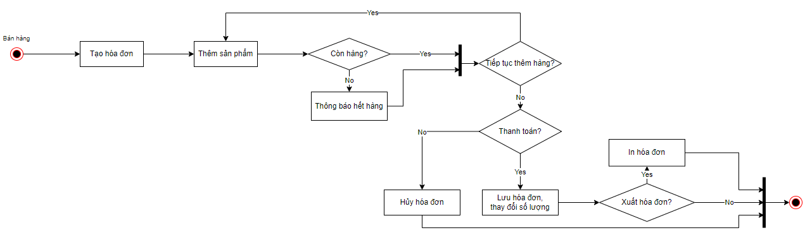

# Ứng dụng Cửa hàng tiện lợi - P1: Phân tích và mô hình hóa
## Ý tưởng của ứng dụng
Ứng dụng dựa trên hoạt động từ các cửa hàng bán lẻ xung quanh chúng ta, đó có thể là các quầy bán thức ăn nhanh, shop quần áo, mĩ phẩm. Trong lần thực hiện dự án này,
tôi lựa chọn việc xây dựng ứng dụng dựa trên các shop bán hàng khá phổ biến với lượng hàng hóa vô cùng đa dạng như Family Mark, MiniStop,...  
Ứng dụng tập trung vào khả năng kiểm soát hàng hóa bên trong cửa hàng, giữa việc quản lý các mặt hàng, nhập và bán, cũng như thống kê doanh thu theo chu kỳ.  

> Bên cạnh đó, ứng dụng cũng sẽ đề cập đến việc kiểm soát các nhân viên làm việc cho cửa hàng dành cho chủ cửa hàng.
> Việc liên lạc với nhân viên trực tuyến đã trở nên khá phổ biến. Đây sẽ là phần mở rộng cho ứng dụng.

## Khâu thiết kế
Phần quan trọng đối với mỗi dự án luôn là việc xây dựng những cấu trúc đầu tiên, việc định hình được cấu trúc của một chương trình sẽ giúp cho chúng ta hiểu rõ các vấn đề
cần thiết bên trong, tăng tốc độ code và giảm thiểu những sai sót về cấu trúc cũng như logic trong quá trình hoàn thành.
Trong bài viết này, tôi sẽ đề cập đến các lược đồ cơ bản như là **Use-case**, **Activity diagram** và **ER diagram**
### Use-case
Đây là lược đồ mang tính quyết định đến sự khái quát về các tính năng và tác nhân cơ bản bên trong chương trình.    

### Activity diagram
Lược đồ hoạt động sẽ giúp bạn định hình các hoạt động liên quan đến hệ thống và tác động của nó trong quá trình làm việc.  
Các **Activity diagram** sẽ được tạo nên dựa trên các **Use-case** đã đề cập trước đó.    
  
_Activity diagram cho Use-case đăng nhập_   
  
_Activity diagram cho Use-case thêm, cập nhật, xóa_   
  
_Activity diagram cho Use-case bán hàng_  
  
_Activity diagram cho Use-case nhập hàng_   
  
_Activity diagram cho Use-case thống kê_  
### ER Diagram
Trước khi làm đến lược đồ này, chúng ta đã khái quát được các chức năng và hoạt động bên trong hệ thống, phần còn lại là hình dung được các thực thể sẽ hoạt động như thế nào
phía bên trong hệ thống. Đây chính là lúc tạo ra ER diagram để có thể hình dung cụ thể hơn mức độ tương tác giữa các thực thể,
nghiên cứu về thông tin của từng thực thể và phân tích chi tiết các hành động để tiến hành thiết lập cơ sở dữ liệu.    

[P2: Triển khai cơ sở dữ liệu](./Part2.md)  
[P3: Thiết kế giao diện người dùng](./Part3.md)  
[P4: Lập trình kết nối và chức năng](./Part4.md)  
[Về trang chủ](/FiFineBlog/)
