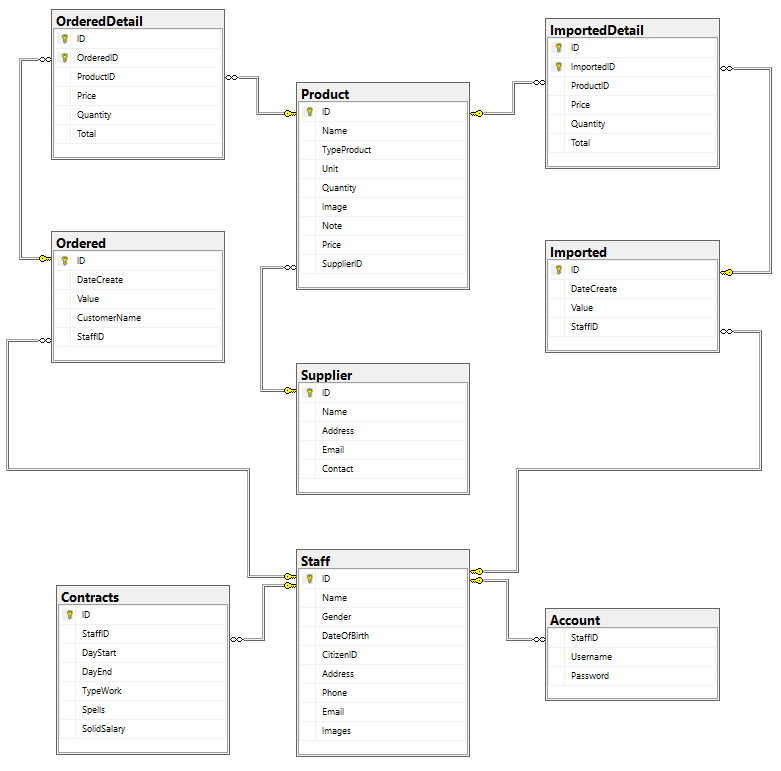

# Ứng dụng Cửa hàng tiện lợi - P2: Triển khai cơ sở dữ liệu
## Tiến hành thiết lập cơ sở dữ liệu
Trong ứng dụng này, tôi sử dụng Hệ quản trị cơ sở dữ liệu là **Microsoft SQL Server** vì ứng dụng chính sẽ được viết trên IDE **Microsoft Visual Studio 2019** ~~bản community~~. Việc sử dụng **Microsoft SQL Server** sẽ tăng tính bảo mật của thông tin, ~~(một phần là do tôi quen với cái này)~~ tuy nhiên các bạn hoàn toàn có thể dùng MySQL, SQLite, ... tùy ý theo nhu cầu và khả năng của mình.
## 1. Các bảng bên trong cơ sở dữ liệu

	[ID] [char](20) NOT NULL,
	[Name] [nvarchar](255) NOT NULL,
	[TypeProduct] [nvarchar](50) NULL,
	[Unit] [nvarchar](50) NULL,
	[Quantity] [int] NOT NULL,
	[Image] [image] NULL,
	[Note] [nvarchar](255) NULL,
	[Price] [float] NOT NULL,
	[SupplierID] [char](20) NULL
*Bảng sản phẩm*

	[ID] [char](20) NOT NULL,
	[Name] [nvarchar](255) NOT NULL,
	[Gender] [nchar](8) NOT NULL,
	[DateOfBirth] [date] NOT NULL,
	[CitizenID] [char](12) NOT NULL,
	[Address] [nvarchar](255) NOT NULL,
	[Phone] [char](15) NOT NULL,
	[Email] [varchar](50) NULL,
	[Images] [image] NULL
*Bảng nhân viên*

	[ID] [char](20) NOT NULL,
	[StaffID] [char](20) NULL,
	[DayStart] [date] NOT NULL,
	[DayEnd] [date] NOT NULL,
	[TypeWork] [varchar](50) NOT NULL,
	[Spells] [varchar](50) NULL,
	[SolidSalary] [int] NULL
*Bảng hợp đồng (nhân viên)*

	[ID] [char](20) NOT NULL,
	[Name] [nvarchar](255) NOT NULL,
	[Address] [nvarchar](255) NOT NULL,
	[Email] [varchar](50) NOT NULL,
	[Contact] [char](15) NOT NULL
*Bảng nhà cung cấp*

	[ID] [char](25) NOT NULL,
	[DateCreate] [datetime] NOT NULL,
	[Value] [float] NOT NULL,
	[CustomerName] [nvarchar](255) NULL,
	[StaffID] [char](20) NULL
*Bảng mua hàng*

	[ID] [char](25) NOT NULL,
	[DateCreate] [datetime] NOT NULL,
	[Value] [float] NOT NULL,
	[StaffID] [char](20) NULL
*Bảng nhập hàng*  

	[ID] [char](5) NOT NULL,
	[OrderedID] [char](25) NOT NULL,
	[ProductID] [char](20) NULL,
	[Price] [float] NOT NULL,
	[Quantity] [int] NOT NULL,
	[Total] [float] NOT NULL
*Bảng chi tiết mua hàng*

	[StaffID] [char](20) NULL,
	[Username] [varchar](50) NOT NULL,
	[Password] [varchar](50) NOT NULL
*Bảng tài khoản (nhân viên)*

	[Name] [nvarchar](255) NOT NULL,
	[Phone] [char](15) NOT NULL,
	[DateJoin] [date] NOT NULL,
	[Value] [float] NOT NULL,
	[Level] [char](30) NOT NULL
*Bảng Khách hàng thành viên*

	[ID] [char](5) NOT NULL,
	[ImportedID] [char](25) NOT NULL,
	[ProductID] [char](20) NULL,
	[Price] [float] NOT NULL,
	[Quantity] [int] NOT NULL,
	[Total] [float] NOT NULL
*Bảng chi tiết phiếu nhập hàng*

### Hình ảnh chi tiết các bảng

## 2. Tạo các Trigger
- Kiểm tra thời hạn hợp đồng nhập vào
- Kiểm tra số lượng sản phẩm khi thêm, sửa, xóa phiếu nhập hàng / bán hàng
- Kiểm tra và chỉnh sửa cấp độ của **khách hàng thành viên**
- Kiểm tra Số lượng sản phẩm khi bán hàng
- Tự động tạo tài khoản cho nhân viên mới

## 3. Các thủ tục (Store Procedure)
- Thêm, sửa, xóa tài khoản
- CUD hợp đồng
- CUD khách hàng thành viên
- CUD phiếu nhập / chi tiết phiếu
- CUD phiếu bán hàng / chi tiết phiếu bán hàng
- CUD sản phẩm
- CUD nhân viên

## 4. Các hàm (Function)
- Kiểm tra thông tin đăng nhập
- Xem số lượng phiếu nhập / bán hàng / nhân viên
- Xem số lượng sản phẩm còn trong kho
- Số lượng sản phẩm bán ra / mua vào
  - Trong ngày
  - Trong tháng
- Kiểm tra hợp đồng nhân viên
- Tìm nhân viên bằng:
  - Hợp đồng (còn hạn, sắp hết hạn, hết hạn)
  - Tên
  - Khoảng tuổi
  - Địa chỉ
  - Giới tính
  - Loại công việc
  - Buổi làm việc (tùy chọn)
- Tìm nhà cung cấp bằng:
  - Tên
  - Địa chỉ
  - Loại sản phẩm (của nhà cung cấp đó)
- Tìm sản phẩm bằng:
  - Tên 
  - Loại sản phẩm
  - Nhà cung cấp
  - Khoảng giá
 - Tìm phiếu nhập hàng / bán hàng trong khoảng thời gian

### [Source code sql](./GroceryStore.sql)

[P1: Phân tích và mô hình hóa](./Part1.md)  
[P3: Thiết kế giao diện người dùng](./Part3.md)  
[P4: Lập trình kết nối và chức năng](./Part4.md)  
[Về trang chủ](/FiFineBlog/)
